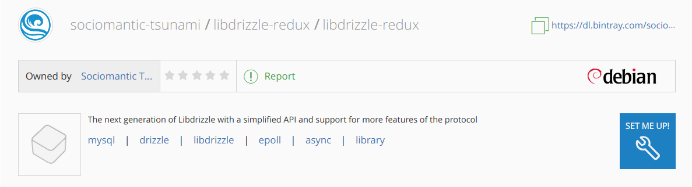

Installing Libdrizzle Redux
===========================

Debian
------

For ``Debian`` based systems running **ubuntu xenial** ``deb`` packages are
available in the project's **apt** repository at `bintray`_.

To add the **apt** repository to your system follow the instructions given
when clicking on the **[set up me]!** button.



The parameter ``{distribution}`` should be ``xenial`` while ``{components}`` can be
``release`` and/or ``prerelease``. E.g::

   https://dl.bintray.com/sociomantic-tsunami/libdrizzle-redux xenial release prerelease

Then run::

    sudo apt update
    sudo apt install libdrizzle-redux6 (for versions on the v6.x branch)

.. _`bintray`: https://bintray.com/sociomantic-tsunami/libdrizzle-redux/libdrizzle-redux

Redhat
------
Distribution packages are not available for ``Redhat`` based systems, but ``rpm``
packages can be generated by running ``make rpm``.

Compiling Libdrizzle Redux
==========================

Building Libdrizzle Redux
-------------------------

To build libdrizzle-redux you can invoke bootstrap script::

   bootstrap.sh

Alternatively you can build and customize::

   mkdir build && cd build
   autoreconf -fi ..
   ../configure
   make
   make install

Please check the `RELEASE NOTES`_ for a list of dependencies specific to the
version of the library you are trying to compile.

.. _test-suite:

Running the Test Suite
----------------------

Libdrizzle has a unit test suite, it needs a running MySQL server which has a
user that can create databases, tables and can connect as a MySQL slave.

The test suite uses system environment variables to find the MySQL server:

* ``MYSQL_SERVER`` - The hostname of the MySQL server (default localhost)
* ``MYSQL_PORT`` - The port number of the MySQL server (default 3306)
* ``MYSQL_USER`` - The username for the MySQL connection (default empty)
* ``MYSQL_PASSWORD`` - The password for the MySQL username (default empty)
* ``MYSQL_SCHEMA`` - The default database for the MySQL connection (default empty)

The test suite can then be run using ``make check`` or ``make distcheck`` for
testing a source distribution rather than the straight git branch.

To test with valgrind you can run the following::

``TESTS_ENVIRONMENT="./libtool --mode=execute valgrind --error-exitcode=1 --leak-check=yes --track-fds=yes --malloc-fill=A5 --free-fill=DE" make check``

Building For OSX (clang and gcc)
--------------------------------

You can compile the source code with the ``clang`` compiler provided by
**Xcode Command Line Tools**.
Alternatively you can use Homebrew_ to install a specific ``gcc`` or ``clang``
compiler. Regardless of the choice of compiler, you will need to install **Xcode**
and the **Xcode Command Line Tools**.

Compatible compilers:

+-----------------------+----------+
| Compiler              | Version  |
+-----------------------+----------+
| GNU gcc               |  >= 4.5  |
+-----------------------+----------+
| LLVM clang            |  >= 3.3  |
+-----------------------+----------+
| Apple LLVM clang [#]_ |  >= 6.1  |
+-----------------------+----------+

.. [#] The version listed for Apple LLVM is the compiler used in the OS X builds
       on Travis CI. However earlier versions should be compatible as long as
       they support C++11 features, i.e. Apple LLVM 5.0, Xcode 5.0 and later.

#. Install the dependencies specified in the `RELEASE NOTES`_ of the latest minor release.

#. Ensure **OpenSSL** headers are linked by creating a symlink::

      ln -sf "$(brew --prefix openssl)/include/openssl" /usr/local/include/openssl

   or pass the OpenSSL directory to ``configure`` using ``--with-openssl``::

      ./configure --with-openssl=$(brew --prefix openssl)

#. Optionally set the C and C++ compiler before running ``configure``, e.g.::

      autoreconf -fi
      CC=gcc-4.9 CXX=g++-4.9 ./configure
      make

Building code coverage
----------------------

Compiling the library with code coverage is supported for GCC and LLVM based compilers on linux and OSX.
The coverage report tool ``lcov`` is a common requirement used to build the html coverage report. However the tool that generates the coverage depends on the compiler and build system and must in some cases be specified using the ``configure`` option ``--with-cov-tool=``. If the coverage tool is added to **PATH** only the name of the executable is required, else the full path should be specified.

The general steps to build code coverage is::

      autoreconf -fi
      ./configure --enable-code-coverage [--with-cov-tool=]
      make check-code-coverage

Note that coverage files generated by GCC compilers cannot be processed by the coverage tool available in the **XCode Command Line Tool Package** and visa versa.


Coverage tool for different compiler and build system
^^^^^^^^^^^^^^^^^^^^^^^^^^^^^^^^^^^^^^^^^^^^^^^^^^^^^

GCC (Linux, OSX)
""""""""""""""""

With GCC compilers the default coverage tool is ``gcov``. Thus, if ``gcov`` is in **PATH** it is not required to set ``--with-cov-tool=`` unless an alternative version of ``gcov`` should be used.

Clang from LLVM (Linux, OSX)
""""""""""""""""""""""""""""

In this case LLVM's own coverage tool called ``llvm-cov`` must be used to process the coverage files. If ``llvm-cov`` is in **PATH** it is not required to set ``--with-cov-tool=`` unless an alternative version of ``llvm-cov`` should be used.


Clang from XCode Developer Tools Package (OSX)
""""""""""""""""""""""""""""""""""""""""""""""

On OSX the **XCode Command Line Tool Package** provides ``llvm-cov``. However it doesn't
provide the ``lcov`` report tool so it must be installed additionally using e.g. **Homebrew** or
**Macports**

Check that the **XCode Command Line Tool Package** are installed on the system::

  xcode-select -p

If not then install the package by running::

  xcode-select --install

Find the ``llvm-cov`` executable by running::

  ``xcrun -f llvm-lcov``

Then either add the bin directory to **$PATH** or specify the full name when running configure using ``--with-cov-tool=`xcrun -f llvm-lcov```


Linking Your Application
------------------------

Ensure the library is in your library and include paths. For releases prior to
version ``v6.0.2`` linking your app against libdrizzle-redux requires the flag
``-ldrizzle-redux``::

    g++ app.c -oapp -ldrizzle-redux6 -lssl -lcrypto -pthread

From version ``v6.0.3`` and later the API level of the library is appended to
the installed library name [1]_. This is also reflected in the install path for
development headers which now follows the pattern::

    /<include-prefix>/libdrizzle-redux[MAJOR_VERSION]/libdrizzle-redux

Thus, linking against ``libdrizzle-redux v6.0.3`` requires the flag
``-ldrizzle-redux6`` and if headers are included to add
``-I/<prefix>/libdrizzle-redux6``, e.g.::

    g++ app.c -oapp -I/usr/include/libdrizzle-redux6 -ldrizzle-redux6 -lssl -lcrypto -pthread

Another option is to link against libdrizzle-redux using the full name of the
dynamic library, e.g.::

    g++ app.c -oapp -I/usr/include/libdrizzle-redux6 -l:libdrizzle-redux6.so.13 -lssl -lcrypto -pthread

A tool called **libdrizzle-redux_config** is included to also assist with this.

.. _RELEASE NOTES: https://github.com/sociomantic-tsunami/libdrizzle-redux/releases

.. rubric:: Footnotes

.. [1] v6.0.2 added the major version to the package name and the library file
       but the release is deprecated since the linking did not work correctly.
.. _Homebrew: http://brew.sh
